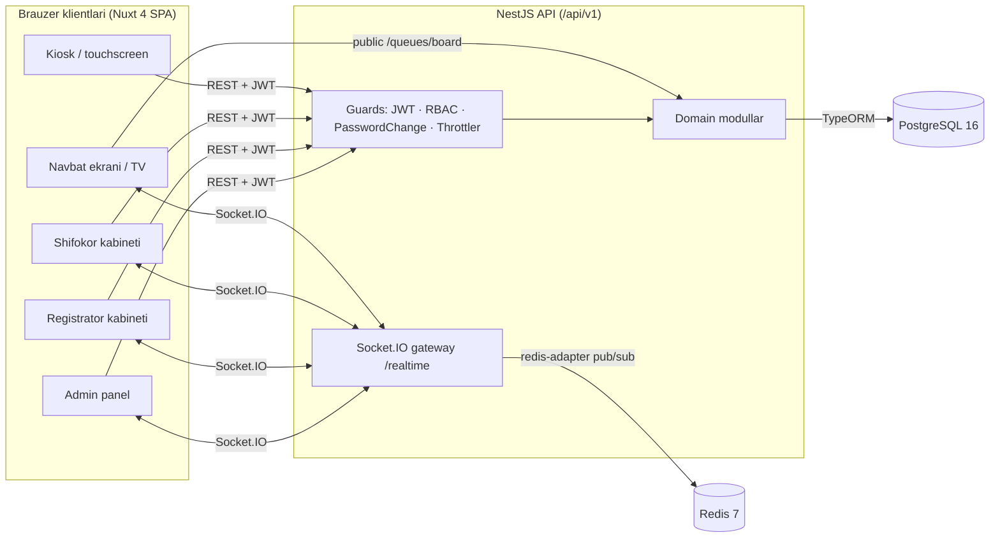
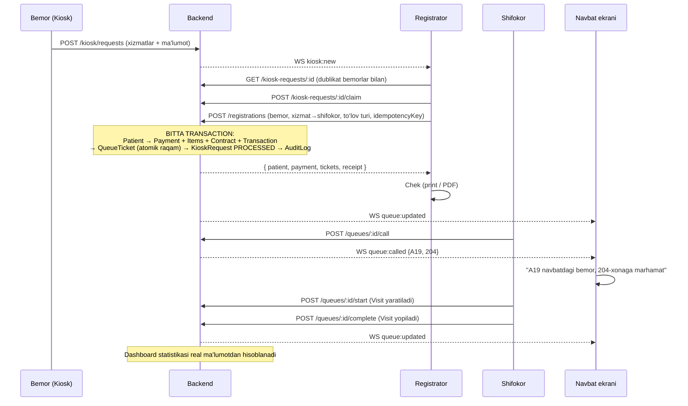

# Arxitektura

## 1. Umumiy ko‘rinish



| Qatlam | Texnologiya | Vazifasi |
|---|---|---|
| Frontend | Nuxt 4, Vue 3, Nuxt UI v4, Tailwind v4, Pinia, VueUse, @nuxtjs/i18n, ECharts, socket.io-client | Rolga qarab 5 ta interfeys (admin, registrator, shifokor, kiosk, TV) |
| Backend | NestJS 11, TypeORM, class-validator, Swagger, Socket.IO | REST API, biznes qoidalar, transaction'lar, real-time |
| DB | PostgreSQL 16 | Barcha ma'lumotlar, sequence'lar, constraint'lar |
| Cache/PubSub | Redis 7 | Socket.IO adapter (bir nechta backend replika), kengaytirish uchun |
| Infra | Docker Compose | dev va prod konfiguratsiya |

## 2. Asosiy qarorlar (va nega)

1. **SPA (`ssr: false`)** — tizim to‘liq autentifikatsiyali (SEO kerak emas), JWT localStorage'da, kiosk va TV ekranlari uzoq ochiq turadi. SSR murakkablik qo‘shadi, foyda bermaydi.
2. **Rol — enum ustun**, alohida `roles` jadvali emas. Rollar ro‘yxati qat'iy (ADMIN, DOCTOR, REGISTRAR, KIOSK) va kod darajasidagi guard'lar bilan bog‘langan. Enum DB-level constraint beradi va JOIN talab qilmaydi. Keyinchalik granular permission kerak bo‘lsa `permissions` jadvali qo‘shiladi — `RolesGuard` interfeysi o‘zgarmaydi.
3. **Doctor = User + Doctor profil (1:1)**. Har bir shifokor tizimga kiradigan foydalanuvchi; shifokorga xos maydonlar (mutaxassislik, xona, ish jadvali) alohida jadvalda.
4. **Pul — `numeric(14,2)`**, float emas. JSON'da number sifatida (UZS'da tiyin ishlatilmaydi).
5. **To‘lovlar cash-flow asosida**: har bir pul harakati (`PAYMENT` / `REFUND`) `payment_transactions` jadvalida. Qisman to‘lov, qo‘shimcha to‘lov va refund shu orqali; hisobotlar transaction'lardan hisoblanadi — shuning uchun tushum hech qachon "qayta yozilmaydi".
6. **Snapshot**: `payment_items` xizmat nomi, kodi va narxini to‘lov paytidagi holatda saqlaydi. Narx o‘zgarsa, eski cheklar o‘zgarmaydi; narx tarixi `service_price_history`da.
7. **Navbat raqami** — `queue_counters (queue_date, prefix)` jadvalida atomik `INSERT … ON CONFLICT DO UPDATE … RETURNING` bilan, checkout transaction ichida. `UNIQUE(queue_date, ticket_number)` qo‘shimcha kafolat. Batafsil: [queue-system.md](queue-system.md).
8. **Idempotency** — registrator har bir checkout urinishi uchun `idempotencyKey` (UUID) yuboradi; `payments.idempotency_key UNIQUE`. Ikki marta bosish / tarmoq retry ikkinchi to‘lov yaratmaydi.
9. **Rasm saqlash** — hozircha Base64 data URL DB'da, lekin `ImageStorage` interfeysi orqali. S3/MinIO'ga o‘tish uchun faqat yangi provider yoziladi.
10. **Audit — transaction ichida**. `AuditService.log(manager, …)` asosiy operatsiya bilan bitta transaction'da yoziladi: operatsiya rollback bo‘lsa audit ham rollback bo‘ladi, muvaffaqiyatli bo‘lsa audit albatta bor.
11. **WebSocket eventlar commit'dan keyin** yuboriladi — klient hali commit bo‘lmagan ma'lumotni so‘ramasligi uchun.
12. **Refresh token rotation** — refresh token DB'da hash ko‘rinishida; har refresh'da yangisi beriladi, eskisi bekor qilinadi. Eski token qayta ishlatilsa (o‘g‘irlik belgisi) foydalanuvchining barcha sessiyalari bekor qilinadi.

## 3. Asosiy business flow



## 4. Backend modullari

```
backend/src/
├── main.ts                 # bootstrap: helmet, cors, body limit, prefix, swagger, redis adapter
├── app.module.ts
├── config/                 # env validation, typed config
├── common/                 # guards, decorators, filters, interceptors, pagination, validators
├── database/               # data-source.ts, naming strategy, migrations/, seeds/
└── modules/
    ├── auth/               # login, refresh, logout, me, change-password, JWT strategy
    ├── users/              # xodimlar CRUD
    ├── doctors/            # shifokor profil, xona, jadval, xizmatlar
    ├── departments/        # bo‘limlar + navbat prefikslari
    ├── services/           # xizmatlar, narx tarixi, shifokorlarga biriktirish
    ├── patients/           # bemorlar, qidiruv, dublikat tekshiruvi, tarix
    ├── kiosk/              # katalog, murojaatlar
    ├── registrations/      # checkout — asosiy transaction
    ├── payments/           # to‘lov, qisman to‘lov, refund, bekor qilish, chek
    ├── queues/             # navbat state machine, board
    ├── visits/             # ko‘rik (visit)
    ├── reports/            # dashboard, agregatlar
    ├── exports/            # xlsx (exceljs) va pdf (pdfkit)
    ├── audit/              # audit log
    ├── login-history/
    ├── settings/           # tizim sozlamalari
    ├── realtime/           # Socket.IO gateway
    └── health/
```

Har bir modul: `*.entity.ts` → `dto/` → `*.service.ts` (biznes logika, repository) → `*.controller.ts` (HTTP, Swagger, RBAC).

## 5. Frontend struktura

```
frontend/app/
├── app.vue · app.config.ts
├── assets/css/main.css
├── components/             # common/, charts/, patients/, payments/, queue/, kiosk/, receipt/ …
├── composables/            # useApi, usePaginatedList, useRealtime, useVoiceAnnouncer, useMoney, useDate …
├── layouts/                # default (sidebar), kiosk, display, auth
├── middleware/             # auth.global.ts (RBAC route guard)
├── pages/
│   ├── login.vue · change-password.vue · profile.vue
│   ├── admin/              # dashboard, patients, staff, doctors, departments, services, queues, payments, reports, audit, login-history, settings
│   ├── registrar/          # inbox, checkout, patients, payments, queues
│   ├── doctor/             # kabinet
│   ├── kiosk/              # touchscreen flow
│   └── display/            # TV navbat ekrani
├── stores/                 # auth, settings, realtime
├── types/                  # API tiplari (docs/api.md bilan bir xil)
└── utils/
i18n/locales/uz.json · ru.json
```

## 6. Xavfsizlik

| Tahdid | Himoya |
|---|---|
| Parol o‘g‘irlash | bcrypt (12 round), plain text hech qayerda yo‘q, login rate-limit (10/min/IP), barcha urinishlar `login_history`da |
| Default parol | `NODE_ENV=production`da seed qilingan akkauntlar `mustChangePassword=true` — parol almashtirilmaguncha API bloklanadi |
| Token o‘g‘irlash | qisqa access token (15 min), refresh rotation + reuse detection, logout/parol almashtirish/deaktivatsiyada revoke |
| Ruxsatsiz kirish | Global `JwtAuthGuard` (default yopiq, `@Public()` bilan ochiladi) + `RolesGuard`; har so‘rovda user statusi tekshiriladi (bloklangan user darhol chiqariladi). Frontend guard faqat UX uchun |
| SQL injection | TypeORM parametrlari; raw SQL'da faqat `$1` parametrlar; `sortBy` whitelist |
| XSS | Vue avtomatik escaping, `v-html` ishlatilmaydi; Helmet CSP/headers |
| Katta payload | `BODY_LIMIT`, Base64 rasm: MIME + magic bytes + ≤2 MB tekshiruvi |
| Mass-assignment | `ValidationPipe({ whitelist, forbidNonWhitelisted })` |
| CORS | faqat `CORS_ORIGINS` ro‘yxati |
| Double submit | `idempotencyKey` + DB unique |
