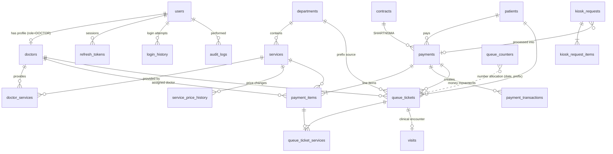

# Database design

PostgreSQL 16 · TypeORM 0.3 · `synchronize: false` — the schema is owned by migrations
(`backend/src/database/migrations`). Naming: snake_case tables/columns (custom `SnakeNamingStrategy`),
UUID primary keys (`gen_random_uuid()` from `pgcrypto`), money as `numeric(14,2)` (exposed as JSON numbers),
timestamps as `timestamptz` (all "today" logic uses the configured timezone, default `Asia/Tashkent`).

## ER diagram



## Tables

| Table | Purpose | Key columns / constraints |
|---|---|---|
| `users` | Staff & kiosk accounts | `login` UNIQUE, `role` enum (ADMIN/DOCTOR/REGISTRAR/KIOSK), `status` enum, `password_hash` (bcrypt), `must_change_password`, `avatar` (base64 data URL) |
| `refresh_tokens` | Refresh-token sessions (rotation) | PK = JWT `jti`, `token_hash` (SHA-256), `revoked_at`, `replaced_by_id`, `login_history_id` |
| `doctors` | Doctor profile 1:1 with user | `user_id` UNIQUE FK RESTRICT, `specialty`, `room_number`, `work_schedule` jsonb, `is_available` |
| `doctor_services` | Doctor ⇄ service (M:N) | UNIQUE(`doctor_id`,`service_id`), CASCADE on both sides |
| `departments` | Service groups | `code` UNIQUE, `queue_prefix` UNIQUE (1–3 letters), `is_active`, `sort_order` |
| `services` | Billable services | `code` UNIQUE, `department_id` FK RESTRICT, `price` CHECK ≥ 0, `is_active` |
| `service_price_history` | Every price change | old/new price, `changed_by_id`, `changed_at` |
| `patients` | Patients | `patient_code` UNIQUE default `'P-' ‖ lpad(nextval('patient_code_seq'))`, trigram indexes on names/phone |
| `kiosk_requests` / `kiosk_request_items` | Self-registration from the touchscreen | `number` from `kiosk_request_number_seq` (starts at 1001), status NEW → IN_REVIEW → PROCESSED/CANCELLED, price snapshot per item |
| `contracts` | Organisations for SHARTNOMA payments | `contract_number` UNIQUE |
| `payments` | One checkout | `receipt_number` UNIQUE, `idempotency_key` UNIQUE, totals, `method` enum, `status` enum, CHECK amounts ≥ 0 and refunded ≤ paid |
| `payment_items` | Services on a payment | snapshots of `service_name`, `service_code`, `price`; `department_id`, `doctor_id` |
| `payment_transactions` | Every money movement | `type` PAYMENT/REFUND, `method`, `amount` CHECK > 0 — **revenue reports are computed from here** |
| `queue_counters` | Ticket number allocator | PK (`queue_date`, `prefix`), `last_number` |
| `queue_tickets` | Queue entries | UNIQUE(`queue_date`, `ticket_number`), status enum, `room_number` snapshot, `called_at`, `called_count`, `started_at`, `completed_at` |
| `queue_ticket_services` | Services served under a ticket | links to `payment_items` |
| `visits` | Clinical encounter | `queue_ticket_id` UNIQUE, complaint / diagnosis / notes |
| `audit_logs` | Change journal | `action` enum, `module`, `entity`, `entity_id`, `old_value`/`new_value` jsonb (secrets stripped, images replaced by `[image]`), IP, UA |
| `login_history` | Login attempts | success/failure reason, IP, UA, parsed browser/OS/device, `logout_at` |
| `system_settings` | Key/value settings | `key` PK, `value` jsonb |

### Why a `role` enum column instead of a `roles` table

The four roles are fixed by the business process and each one is hard-wired to different UI areas and
API guards (`@Roles(...)`). A lookup table would add a join to every authenticated request without
adding flexibility (permissions are code, not data). Adding a role is a code change + one
`ALTER TYPE user_role ADD VALUE` migration. If fine-grained, admin-editable permissions are needed
later, introduce `permissions` + `role_permissions` tables and keep the enum as the role key.

## Indexes (hot paths)

| Query | Index |
|---|---|
| Login by login | `uq_users_login` |
| Patient search | GIN trigram on `lower(first_name)`, `lower(last_name)`, `phone`; btree on `phone`, `passport`, `created_at` |
| Doctor's queue today | `idx_queue_tickets_doctor_date_status (doctor_id, queue_date, status)` |
| Board / queue lists | `idx_queue_tickets_date_status (queue_date, status)` |
| Payment lists & reports | `payments (created_at)`, `(status)`, `(method)`, `(patient_id)`; `payment_items (payment_id / service_id / doctor_id / department_id)` |
| Revenue reports | `idx_payment_transactions_created_method (created_at, method)` |
| Kiosk inbox | `idx_kiosk_requests_status_created (status, created_at)` |
| Audit | `(created_at)`, `(user_id, created_at)`, `(entity, entity_id)`, `(module, action)` |
| Login history | `(user_id, login_at)`, `(login_at)` |

## Referential integrity

Financial and clinical data use `ON DELETE RESTRICT` (payments, items, transactions, tickets, visits):
nothing that has ever been billed can disappear. Staff/departments/services are *deactivated*, never
deleted. Actor references (`created_by_id`, `changed_by_id`, audit `user_id`) use `ON DELETE SET NULL`.

## Transactions & locking

| Operation | Isolation / locks |
|---|---|
| Checkout (`POST /registrations`) | Single transaction: kiosk request `SELECT … FOR UPDATE` → patient insert → payment + items + transaction → per-doctor ticket numbers via counter upsert (row lock) → kiosk request PROCESSED → audit rows. Any error rolls back everything. |
| Ticket numbers | `INSERT INTO queue_counters … ON CONFLICT (queue_date, prefix) DO UPDATE SET last_number = last_number + 1 RETURNING last_number` — atomic, row-locked until commit. Prefixes are allocated in sorted order to avoid deadlocks. `UNIQUE(queue_date, ticket_number)` is the final guard. |
| Duplicate payment | `payments.idempotency_key` UNIQUE. The service first looks the key up; a concurrent duplicate hits the unique violation (Postgres waits for the first transaction), rolls back and returns the winner's result. |
| Payment top-up / refund / cancel | Payment row `FOR UPDATE`, status recomputed by `computePaymentState()`; every money movement is a `payment_transactions` row. |
| Queue transitions | Ticket row `FOR UPDATE`; state machine validated server-side; "one IN_PROGRESS per doctor" checked inside the transaction. |
| Kiosk claim | Request row `FOR UPDATE`; claim expires after 10 minutes. |

Audit rows for these operations are written **with the same `EntityManager`**, so they commit or roll
back together with the business change.

## Migrations & seed

```bash
cd backend
npm run migration:generate -- src/database/migrations/<Name>   # after entity changes
npm run migration:run
npm run migration:revert
npm run seed                                                    # idempotent
```

In Docker the entrypoint runs `migration:run` (`RUN_MIGRATIONS=true`) and the seed (`RUN_SEED=true`).
