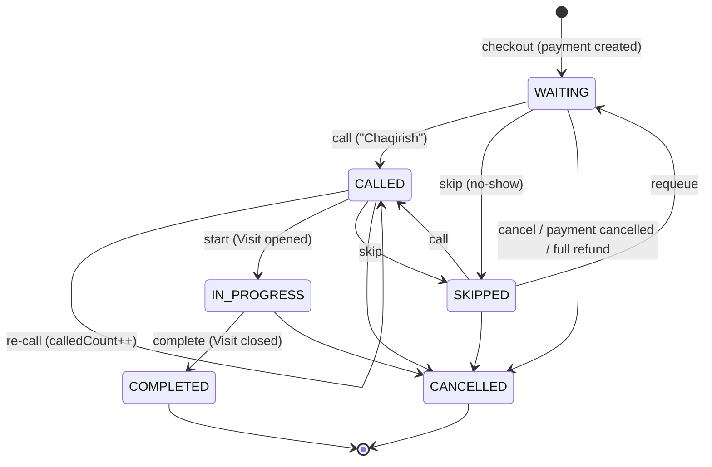

# Queue system

## Lifecycle



The table lives in `backend/src/modules/queues/domain/queue-state-machine.ts` and is unit-tested.
Invalid transitions return **409 CONFLICT**. A doctor can only act on their own tickets (403 otherwise)
and can have at most one `IN_PROGRESS` ticket.

`transfer` (registrar/admin) moves a `WAITING`/`SKIPPED` ticket to another available doctor who provides
all of the ticket's services; the room number follows the new doctor.

## Ticket numbers

* One ticket **per doctor** per checkout (a patient with a cardiologist visit + a blood test gets two tickets:
  `A21` → room 204, `L9` → room 101).
* Prefix = `Department.queuePrefix` of the ticket's first service (unique per department, editable by admin).
* Numbers restart every day (in the configured timezone): `A1, A2, …`.
* Allocation is atomic (`queue_counters` upsert inside the checkout transaction), see `docs/database.md`.
  Verified with 20 parallel checkouts → 20 distinct numbers.

## Calling a patient

`POST /queues/:id/call`:

1. ticket → `CALLED`, `called_at = now()`, `called_count++`, `called_by_id`, `room_number` refreshed from the
   doctor's **current** room (room changes are respected);
2. audit row `QUEUE_CALL`;
3. after commit, Socket.IO emits `queue:called` to the `board` room (public TV screens), staff rooms and the doctor's room:

```json
{ "ticketId": "…", "ticketNumber": "A19", "roomNumber": "204", "doctorName": "Dr. Aliyev Anvar",
  "departmentName": "Kardiologiya", "calledAt": "2026-10-01T09:30:00.000Z", "calledCount": 1 }
```

The display screen shows `A19 → 204-xona` and (if `voiceAnnouncements` is on) speaks
"A19 navbatdagi bemor, 204-xonaga marhamat." in `announcementLanguage`.

## Real-time

Socket.IO namespace `/realtime` (path `/socket.io`).

| Client | Auth | Rooms joined |
|---|---|---|
| Queue display (TV) | none | `board` |
| Admin / registrar | `auth.token` = access token | `board`, `role:<ROLE>`, `user:<id>` |
| Doctor | access token | + `doctor:<doctorId>` |

Events: `queue:updated` (refetch lists), `queue:called`, `kiosk:new`, `kiosk:updated`, `payment:updated`.
With several backend replicas the Redis adapter (`@socket.io/redis-adapter`) fans events out; if Redis
is down the backend falls back to the in-memory adapter (single instance still works).

`GET /queues/board` (public) returns only ticket numbers, rooms, department and doctor names — **no patient data**.

## Edge cases covered

| Case | Behaviour |
|---|---|
| Patient does not come | `skip` → `SKIPPED`; later `requeue` or `call` again |
| Payment cancelled (nothing paid) | its WAITING/CALLED/SKIPPED tickets → `CANCELLED` |
| Full refund | WAITING/SKIPPED tickets → `CANCELLED` (completed visits stay) |
| Doctor not available / deactivated | cannot be chosen at checkout; kiosk catalog hides services without an available doctor |
| Doctor changes room | next `call` uses the new room; board "waiting" list shows the doctor's current room |
| Many registrars / kiosks at once | row locks + unique constraints (see database.md) |
